<div align="right">

</div>

[TOC]

# 技能接入入门文档

## 概述

### 什么是技能？

Azero技能定义: Azero操作系统上的云端应用程序。 Azero技能类似于手机操作系统上的应用程序。Azero技能即为Azero操作系统上的语音应用程序，其为Azero操作系统应用体系创造无限可能性。任何应用开发者，都可以通过开发技能，将自己的应用服务触达各个集成Azero智能硬件的终端用户。


### Azero技能中心能做什么？

Azero技能中心是Azero为第三方开发者提供的一整套技能开发、测试、部署工具的开放平台。第三方开发者可以在平台上通过可视化的界面、简单、高效的开发各类Azero技能。


## 如何开发技能

具体开发一个技能的整体流程图如下:

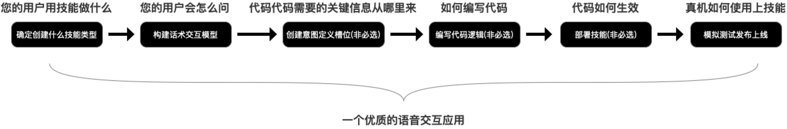

开发者开发技能时需要了解如下事项:

- **您的用户用到该技要做什么。**目的是借用Azero技能中心选择创建什么类型的技能。如用户希望语音交互控制智能家居，则可以选择创建**智能家居技能**。若用户希望语音交互查询信息、使用效率工具(计算器)、玩游戏等，则可以选择创建自定义技能的**任务型**技能。若用户语音交互是一问一答的场景，问题答案都有特定对应关系，则可以选择创建自定义技能的**问答型**技能。

- **您的用户会怎么问。** 目的是将您的技能所覆盖的用户语音交互场景下，可能的用户问法(Azero称其为语料)输入到您技能下的意图中，这样Azero收到用户这类问法时，能清晰判断这些用户请求是否需要传递给您的技能做业务处理。

- **代码需要的关键信息从哪里来。** 代码编辑时需要获取用户语音输入的语句中的关键词，这些关键词可能直接影响到编程过程中的业务逻辑处理。此类关键词在**意图**语料中，是以**槽位**做标识，开发者可以自定义槽位。业务代码通过**Azero请求技能协议**中携带的**槽位标识** 获取该标识下的**槽值**进行业务处理。(详细请参考示例:从0开始创建自定义任务ßß型技能。此条只针对需代码开发的技能)

- **编写代码。** 平台支持3种语言在线编辑，分别为Node.Js、Python、java。您也可以下载下方对应的SDK在本地开发调试再传到平台上在线部署使用。(此条只针对需代码开发的技能。)

  Node.Js SDK：https://github.com/sai-azero/azero-skills-kit-sdk-for-nodejs

  Python SDK：https://github.com/sai-azero/azero-skills-kit-sdk-for-python

  Java SDK：https://github.com/sai-azero/skill-sample-java-hello-world

- **代码如何生效。** 您可以点击**服务部署**下的”服务部署”按钮。部署成功，代码即在平台生效。此时您可以点击**模拟测试**，进行技能测试，输入意图中配的语料查看是否能正常命中您的技能，您技能的响应逻辑是否正常。(此条只针对需代码开发的技能。)

- **真机如何使用上此技能。** 技能模拟测试一切正常后，您可以选择发布技能，发布技能后您就可以为您在设备中心的虚拟设备添加此技能。只要真实设备集成的Azero端侧 SDK(Android、Linux、Rots版本)中刷入虚拟设备的Client ID与Product ID。您真实设备也能立刻使用该技能服务。


具体开发特定技能类型的流程，请查阅本文具体技能介绍。上述粗体部分为Azero平台的专有名词，都在本文中有具体介绍，可以查阅。


## 自定义技能介绍

### 自定义技能

自定义技能包含两种类型技能:任务型技能、问答型技能。

若用户希望语音交互用在，查询信息、使用效率工具(计算器)、玩游戏等复杂场景，则可以创建任务型技能实现需求。

若用户语音交互用在一问一答的简单场景，问题答案都有特定对应关系。则可以创建问答型技能。


#### 任务型技能

任务型技能主要由两大部分构成:**交互模型**与**代码逻辑**。交互模型阐述的是用户使用此技能服务时会怎么说。代码逻辑指的是具体的业务代码。


创建任务型技能具体流程框架:

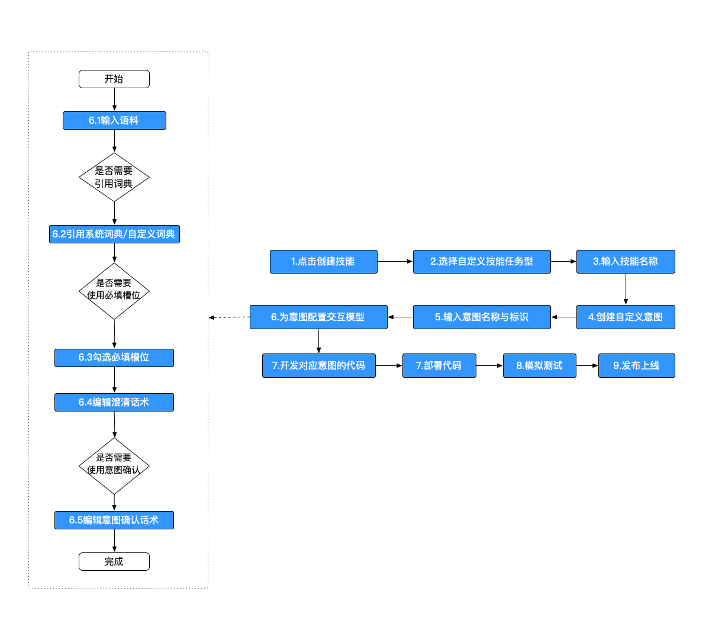

创建自定义意图流程:

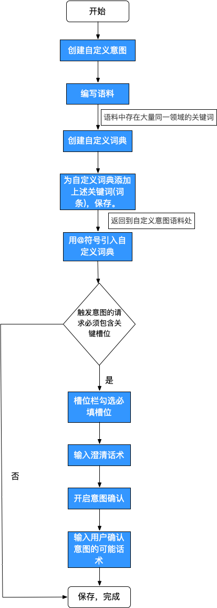

##### 交互模型 -- 重要概念与指南

##### 交互模型

技能交互模型是让技能理解用户自然语言的关键工具。在这里，开发者需要利用意图和词典来定义解析用户语言信息的规则。

如：用户询问“北京今天天气怎么样”，若要让技能程序对这句话进行响应，首先程序需要正确理解这句话。技能交互模型作用就是用于让技能程序能理解这句话的工具。 技能交互模型会先从这句话中提取出来这句话中的三个关键信
息：1、用户在查询天气；2、用户查询的地点是北京；3、用户查询的日期是今天。提取的规则见下文意图与词典的介绍。当交互模型提取出关键信息后，还应将提取的关键信息转换为技能可处理的字段，并发给技能技能程序，详见下文Azero请求技能协议。

##### 意图

一个技能的交互模型一共有两层用于辨识/提取语句中关键信息的维度，第一层便是意图。
当Azero判断用户说的话属于某个技能后，该技能的意图便用于分辨这句话的具体目的。
如：我们建立一个查询天气的技能的交互模型，定义其可解答用户三类请求:

1、查询某日某地的天气；
2、查询某日某地的空气质量；
3、查询某日某地的风力风向。

那么这三类便属于天气技能的下一层信息维度，即意图。若用户说：“北京今天天气怎么样”，
我们首先判断属于天气技能，其次属于“查询某日某地的天气”这一类意图。

平台会根据开发者创建的意图自动生成此意图的代码框架，开发者可以在该框架下完成具体业务逻辑开发。

此外，意图分为系统意图与自定义意图
。Azero官方将很多通用意图进行了预定义，并化作系统意图供开发者调用。这样做的主要原因如下：1、省去每一个技能开发者都要自己重新定义“退出、暂停、下一个”这类高频意
图的步骤；2、面对多个技能定义了同一个意图的情况，采用系统意图可以由系统统一处理意图分配，避免一句话同时命中多个技能的多个意图，导致意图指派混乱的情况。您的
技能若需要定义“下一个，上一个”这类通用意图，请选择引用系统意图，不要将其做成自
定义意图，否则会发生该自定义意图与系统意图冲突导致无法触发的情况。

具体有哪些系统意图可以参考:具体技能下的交互模型 -> 意图管理 -> 系统意图。

##### 词典

一个技能的交互模型一共有两层用于辨识/提取语句中关键信息的维度，第一层是上文
介绍的意图，第二层便是词典。

意图通常用于分辨用户话语的具体目的，而词典则用于进一步分解意图下的其他细节。
如：用户说：“北京今天天气怎么样”。经过交互模型的第一层解析，意图判断为“查询某
日某地的天气”，此时便需要词典这层维度来进一步解析用户是要查“今天”“北京”的天气。

词典通常作为具有某一属性词汇的集合，如：城市（包含所有城市的名称）；日期（包
含所有日期的说法）。

词典的使用是在开发者创建意图的时，作为句子成分放在语料中。如：“北京今天天气
怎么样”我们想让这个句式能匹配所有的城市与日期，便要先引用city与date词典，其次
在语料的句子成分中引用这两个词典：“@{AZERO.City:city}@{AZERO.Date:date}天气怎么样”。
此时便可匹配这两个句式下的所有值。

词典也分系统词典与自定义词典。系统词典您可以在交互模型 -> 词典管理 -> 系统词典。下进行查看。

##### 语料

用户与设备进行语音交互，用户说的每一句话，都称为一条语料。语料与意图相关，在平台上的具体意图中管理。开发者需要把用户想触发某个意图会怎么说的语句都编辑到该意图的语料处，这样Azero才能根据用户说的语句判断需要将此次用户请求转给哪个技能中的哪个意图处理。

##### 澄清话术

澄清话术又名追问话术，当用户一条语音输入，未包含关键的槽位信息时，用于追问用户关键信息时使用。详情请参考示例：从0开始创建自定义型技能。

##### 委派策略

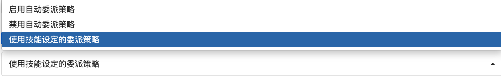


1. **启用自动委派:** 追问全部由Azero系统自动根据用户网站配置的澄清话术、意图确认等处理，当多轮结束后，用户意图信息才会带入到技能内部。
2. **禁用自动委派:** 追问的每一步，都带入到技能内部，技能可以根据下文的开发文档，决定是否延用网站配置的澄清话术、意图确认等信息，还是根据用户的意图信息重新组织追问逻辑。
3. **使用技能设定的委派策略**:意图的委派策略与技能的委派策略相关，即与自动委派的策略相关。

##### 自动委派

自动委派指技能级别的委派策略。开启则为使用技能级别的委派策略。所有意图中的委派策略默认是选择技能级别的委派策略。也就是说，当意图使用技能设定的委派策略时，意图的委派策略与自动委派的状态相关。自动委派开启，意图的委派策略即开启。自动委派关闭，意图的委派策略即关闭。

委派策略与自动委派策略与开发复杂的Dialog-skill技能有关，详情请参考:[Dialog-Skill开发文档](http://wiki.sai.corp/pages/viewpage.action?pageId=16129124)


##### 服务部署 -- 服务协议

开发者在编码技能代码逻辑时，需要关注两套协议:Azero请求技能协议和技能响应用户请求协议。对应着自定义技能的请求协议与响应协议。

##### Azero请求技能协议

用户与设备的每一次语音交互，都由Azero云平台将用户的语音输入内容及一些有用的基本信息转化为Azero请求技能协议。并且会根据设备所配技能中的语料判断，用户此次请求需要传递给哪个技能下的意图处理并传递。开发者可以在对应意图框架代码下根据本协议内容解析出关键信息(如:槽位、槽值、用户语音输入转成文字后的结果(ASR)、IP信息(需要申请获取权限)、经纬度信息(需要申请获取权限)等),做相关业务逻辑开发。

以后面的示例技能为例，传入到技能中的请求协议Json格式如下:。

~~~json
createSkillIntentRequest with object:{"version":"1.0","session":{"new":true,"sessionId":"token.domain-api.session.5e982f02376d150006f8b7f5","application":{"applicationId":"5e9829204e452300089201fa"},"user":{"userId":"anonymous_852e183d016a4641b087676b005849c5"},"attributes":{"source_skill_mapping":{},"smarthome_skill_mapping":{"5e26b0c911fd0e000909dee1":"gyug7","5e3cd14b19e7bc00082d58cb":"mmop","5e1428b3a512ea000800f37a":"智能家居Test","5e58dfb64a89cb000893ce4e":"hiohi"}}},"context":{"System":{"application":{"applicationId":"5e9829204e452300089201fa"},"user":{"userId":"anonymous_852e183d016a4641b087676b005849c5"},"device":{"deviceId":"df5f4bf6f6e5a97e5a7bc9c577f84c54","supportedInterfaces":{"AudioPlayer":{},"Display":{}}}}},"request":{"type":"IntentRequest","requestId":"a852923f-3cad-491a-8b78-161131f3a825","timestamp":"2020-04-16T10:10:10.130Z","dialogState":"COMPLETED","intent":{"slots":{"city1":{"confirmationStatus":"NONE","name":"city1","value":"上海市"},"city":{"confirmationStatus":"NONE","name":"city","value":"北京市"}},"confirmationStatus":"NONE","name":"booktickets"}}}
~~~

该Json被平台封装成了**handlerInput**对象，平台自动生成的代码包含此对象，在如下处:

~~~
...
handle(handlerInput) {
        //此处可以用handlerInput解析相关请求
    }
...
~~~


##### 技能响应用户请求协议

以后面的示例技能为例，技能响应协议在每一个函数的return 方法中，如下图:

~~~
return handlerInput.responseBuilder
            .addRenderTemplateDirective(
            //---------替换开始---------
            {
                type: `BodyTemplate1`,
                title: speakOutput,
                textContent: {
                    "primaryText": {
                        "text": speakOutput,
                        "type": "string"
                    }
                }
            }
            //---------替换结束--------
            )
            .speak('欢迎使用技能')
            .withShouldEndSession(true)
            .getResponse();
~~~

技能的响应都以模板的形式响应,根据您的需求使用下方的模板替换上面代码:

目前支持5种**BodyTemplate** ，2种**ListTemplate** 。

下面介绍**文本展现模板 BodyTemplate1** ，另外类型模板可以查询后文相应SDK文档中的README。

**文本展现模板 BodyTemplate1**

- 此模板适用于展示纯文本信息场景，包含以下内容：
  - title:技能名称或者技能当前页面主题
  - token:模板的唯一标识
  - backButton:开发者在技能发布时需进行上传(可选)，返回按钮(展示/隐藏)
  - backgroundImage:技能交互时作为背景展示的图片（可选）
  - textContent:技能交互时界面展示的文本信息
    - 一级文本:primaryText
    - 二级文本:secondaryText(可选)
    - 三级文本:tertiaryText(可选)

```
{
  "type":"BodyTemplate1",
  "token": "string",
  "backButton": "VISIBLE"(default) | "HIDDEN",
  "backgroundImage": Image,
  "title": "string",
  "textContent": TextContent
}
```

了解更多模板信息，可以参考如下文档:

AZERO SDK for nodejs: https://github.com/sai-azero/azero-skills-kit-sdk-for-nodejs

AZERO SDK for python: https://github.com/sai-azero/azero-skills-kit-sdk-for-python


#### 示例:从0开始创建自定义任务型技能

本示例为开发一个航班技能，用一个定机票的意图举例。带领您从0开始，理解意图、词典、槽位、槽值、澄清话术、意图确认、委派策略与代码之间的联系。

1.1 在控制台中选择要创建的技能类型

进入技能中心首页，点击创建技能，选择自定义技能-任务型，填写技能名称进行创建。

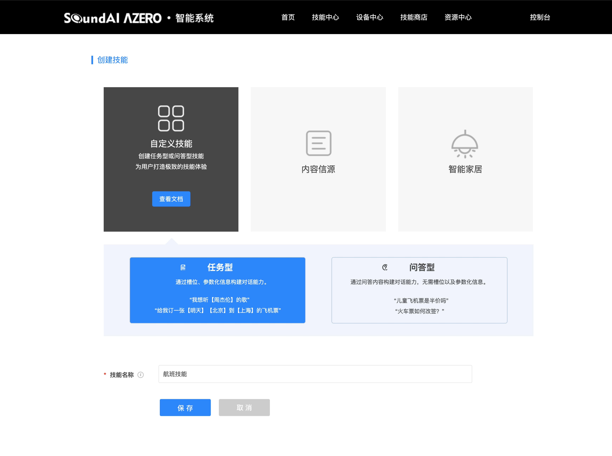

2.1 创建意图

点击创建自定义意图开始进行创建。

2.2 完善意图信息

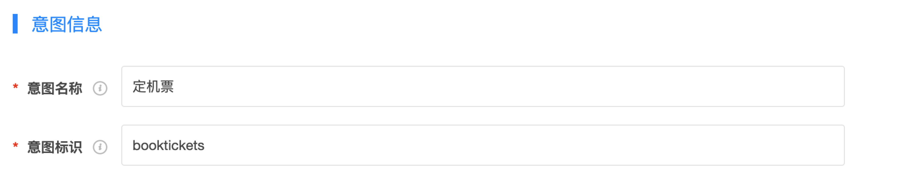

**重点:** 平台会根据您的意图标识在服务部署栏目下的代码处自动生成对应的意图函数代码。开发者对于该意图处理的业务逻辑代码需写在这类函数下。

如该意图标识保存后，平台会根据意图标识在服务部署处生成两个函数(命名规则CompletedDelegateHandler_( CombineDialogDelegateHandler__)加意图标识):

- CompletedDelegateHandler_booktickets:用户与设备进行该意图的语音交互，交互完成后执行该函数。
- CombineDialogDelegateHandler_booktickets:用户与设备进行该意图的语音交互，交互过程中若开发者前台配置希望代码能获取交互中间过程状态(默认不会将过程中的状态传递给技能服务)，则执行该函数。

若您的技能需要对用户交互过程中的状态做特殊处理(代码控制澄清话术、意图确认等)，可以修改(CombineDialogDelegateHandler_前缀的函数)，详见**Dialog-Skill开发文档**，这里不做赘述。

**由于用户每一次与技能服务交互最终都会到CompletedDelegateHandler前缀的函数处，表示一次交互完成。因此您的技能如果不在用户与技能交互过程中做逻辑处理，只需要将业务逻辑写到CompletedDelegateHandler前缀的函数下方即可。**

具体代码如下:

~~~
...

/**
 * Dialog委托场景COMPLETED完成之后Skill完成当前意图 Handle
 * 若完成当前意图后希望转到新意图withShouldEndSession需设为false，且需返回Dialog的Directive
 * @type {{canHandle(*=): *, handle(*=): *}}
 */
const  CompletedDelegateHandler_booktickets = {
    canHandle(handlerInput) {
        return azero.getIntentConfirm(handlerInput,'booktickets')
               && azero.getDialogState(handlerInput)==='COMPLETED';
    },
    handle(handlerInput) {
        let currentIntent = handlerInput.requestEnvelope.request.intent;
        let speakOutput = '欢迎使用技能,您可根据当前意图和槽位返回您想回复的话术';
        return handlerInput.responseBuilder
        	.speak(speakOutput)
        	.withShouldEndSession(true)
        	.getResponse();
    }
};

/**
 * 非自动委托Dialog的澄清话术，验证槽位，确定槽位和确定意图等部分由Skill控制
 * 部分由网站上配置手动委托给Azero DM去追问
 * @type {{canHandle(*=): *, handle(*=): *}}
 */
const  CombineDialogDelegateHandler_booktickets = {
    canHandle(handlerInput) {
        return azero.getIntentConfirm(handlerInput,'booktickets')
               && (azero.getDialogState(handlerInput)==='STARTED'
               || azero.getDialogState(handlerInput)==='IN_PROGRESS');
    },
    handle(handlerInput) {
        let currentIntent = handlerInput.requestEnvelope.request.intent;
        let speakOutput = '您可根据判断意图或者所有槽位返回您想回复的话术和模版';
//        handlerInput.responseBuilder.addElicitSlotDirective("槽位名称",currentIntent);
//        handlerInput.responseBuilder.addConfirmSlotDirective("槽位名称",currentIntent);
//        handlerInput.responseBuilder.addDelegateDirective(currentIntent);
//        handlerInput.responseBuilder.addConfirmIntentDirective(currentIntent);
        return handlerInput.responseBuilder
        	.addDelegateDirective(currentIntent)
        	.speak(speakOutput)
        	.withShouldEndSession(false)
        	.getResponse();
    }
};

...
~~~

2.3编辑语料

用户可能会说:"我想订机票"，”我想订北京到上海的机票“，”我想订上海到北京的机票“。则您可以把这三条话术输入到语料中保存。

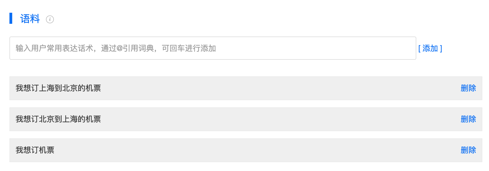

但真实使用场景中，北京上海处可能还有其他的中国城市名，如深圳。这时若一个城市加条语料会有很大的工作负担。因此此处引入词典的概念。词典为同一领域的词汇的集合。如，北京、深圳、上海都为中国城市。平台提供常见的词典，您可以点击词典管理 -> 引用词典 -> 系统词典。查看系统提供的词典，引用于您的技能中。当然您也可以创建自定义的词典。词典管理 -> 创建自定义词典。

这里平台已经提供中国城市词典供开发者使用，因此您需要先保存下意图页面，然后进入到词典管理，点击引用词典，在系统词典下操作城市:

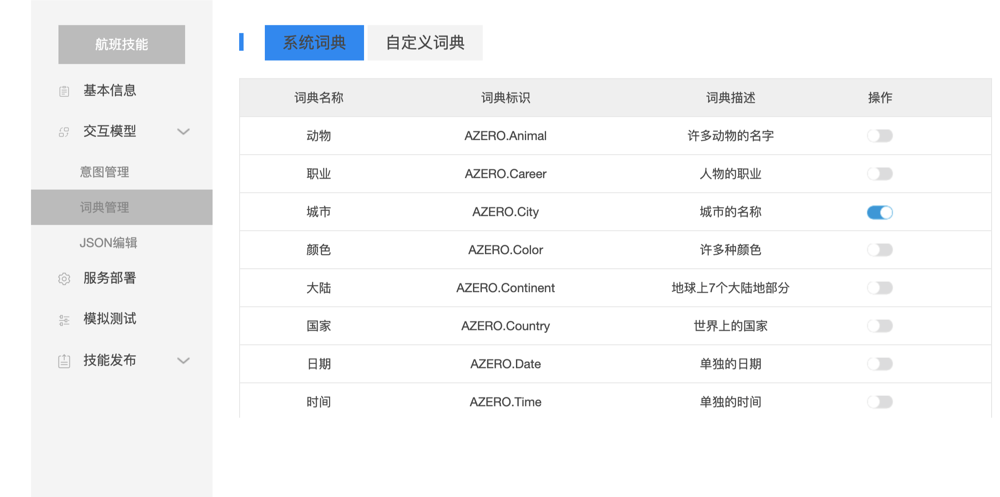

引用成功后您的语料可以这么写:

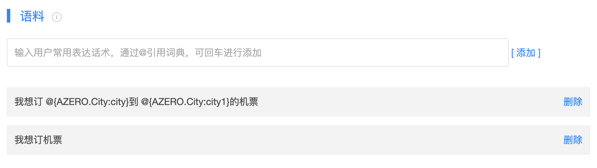

我想定 @{AZERO.City:city} 到 @{AZERO.City:city1} 的机票:就完全能替代上述"我想订北京到上海的机票“，”我想订上海到北京的机票“语料，且远远不止这些，如它还能表示"我想订北京到深圳的机票“、"我想订北京到广州的机票“等。

当使用了@{AZERO.City:city}，您会发现下方**槽位** 处会自定生成如下信息:


此时对于语料”我想定 @{AZERO.City:city} 到 @{AZERO.City:city1}”， @{AZERO.City:city}可以理解为是一个槽位，槽位的名称是city。 @{AZERO.City:city1}也可以理解为是一个槽位，槽位的名称是city1。槽位在编写代码时有重要作用。如:用户语音输入:"我想订北京到上海的机票"，则Azero传入到意图里的Json将包含下方的信息:

~~~json
"intent":{"slots":{"city1":{"confirmationStatus":"NONE","name":"city1","value":"上海市"},"city":{"confirmationStatus":"NONE","name":"city","value":"北京市"}},"confirmationStatus":"NONE","name":"booktickets"}}}
~~~

您的代码可以通过解析传入的json中的“slots”字段获得所有槽位信息。通过槽位名称(name)city1，得到槽值(value)上海。槽位名称(name)city，得到槽值(value)北京。完成您的业务开发。

您也可以在网页上修改槽位名称，city、city1。在代码中更好的解析。如此处city可以修改为fromcity，city1修改为tocity。则请求协议针对用户语音输入:"我想订北京到上海的机票"，会变为:

~~~json
"intent":{"slots":{"tocity":{"confirmationStatus":"NONE","name":"tocity","value":"上海市"},"fromcity":{"confirmationStatus":"NONE","name":"fromcity","value":"北京市"}},"confirmationStatus":"NONE","name":"booktickets"}}}
~~~


2.4 勾选必填槽位、填写澄清话术、开启意图确认

此三项功能主要用于槽位信息缺失时使用。如此技能，在模拟用户语音输入“我想订机票”时，传入技能的信息如下:

~~~json
"intent":{"slots":{"city1":{"confirmationStatus":"NONE","name":"city1"},"city":{"confirmationStatus":"NONE","name":"city"}},"confirmationStatus":"NONE","name":"booktickets"}}}
~~~

此时由于用户的语音输入没有带槽位信息，因此city、city1没有value值，此时技能是不清楚用户想要订什么机票。为了了解清楚用户想要订什么机票，即必须city、city1都有值，此时则需要将city、city1勾选为**必填槽位**。

怎么样子让用户语音输入必填槽位的信息呢？此时就需要用到**澄清话术**，委托Azero系统自动根据澄清话术去追问用户，获取必填槽位的信息。

您可以在city槽位后的澄清话术中添加追问语句:"您想订从哪儿起飞的机票"。在city1槽位后的澄清话术中添加追问语句:"您想订到哪的机票"。这时，即可与用户交互获得city、city1的槽值信息。最后使用**意图确认**, 委托Azero系统发起确认话术：“您确定订一张从北京到上海的机票吗”。用户回复:"确认"。则传入到技能CompletedDelegateHandler_booktickets函数中的信息。如用户一次性说:"我想订北京到上海的机票"一样。

~~~json
"intent":{"slots":{"tocity":{"confirmationStatus":"NONE","name":"tocity","value":"上海市"},"fromcity":{"confirmationStatus":"NONE","name":"fromcity","value":"北京市"}},"confirmationStatus":"NONE","name":"booktickets"}}}
~~~

前端界面信息如下:


整体语音交互结果如下:

~~~
用户:"我想订机票"
Azero:“您想订到哪的机票”
用户:"上海"
Azero:"您想订从哪儿起飞的机票"
用户:”北京“
Azero:"您确定订一张从北京市到上海市的机票吗"
用户:"确定"
Azero:"xxx"（xxx指代您代码CompletedDelegateHandler_booktickets中返回的信息。此处会返回默认生成的话术：“欢迎使用技能,您可根据当前意图和槽位返回您想回复的话术”）
~~~

至此，订机票意图的交互模型已经创建完毕。您当前所在的页面为意图交互模型的可视化操作界面。

此技能的整体交互模型生成在交互模型 -> Json编辑中。

您如果熟练掌握交互模型的构成，可以直接编辑Json编辑中的交互模型。

附件中航班技能的交互模型，为此时该技能的交互模型。您如果想自己尝试构建此航班技能，可以直接复制到您新建技能的交互模型 -> Json编辑处使用。


3. 1 开发代码逻辑

平台已经根据您的意图标识生成了相应框架代码。主要包含如下五个函数:

~~~
/**
 * Dialog委托场景COMPLETED完成之后Skill完成当前意图 Handle
 * 若完成当前意图后希望转到新意图withShouldEndSession需设为false，且需返回Dialog的Directive
 * @type {{canHandle(*=): *, handle(*=): *}}
 */
const  CompletedDelegateHandler_booktickets = {
    canHandle(handlerInput) {
        return azero.getIntentConfirm(handlerInput,'booktickets')
               && azero.getDialogState(handlerInput)==='COMPLETED';
    },
    handle(handlerInput) {
        let currentIntent = handlerInput.requestEnvelope.request.intent;
        let city = azero.getSlot(handlerInput,"city");
        let city1 = azero.getSlot(handlerInput,"city1");
        let speakOutput = '欢迎使用技能,您可根据当前意图和槽位返回您想回复的话术';
        return handlerInput.responseBuilder
        	.speak(speakOutput)
        	.withShouldEndSession(true)
        	.getResponse();
    }
};
~~~

CompletedDelegateHandler_booktickets：表示用户语音交互意图为booktickets时触发。在canHandle中，使用handlerInput判断此时用户与您意图交互是否为交互完成状态:azero.getDialogState(handlerInput)==='COMPLETED',用户是否是真正想请求booktickets意图:azero.getIntentConfirm(handlerInput,'booktickets')为ture。当都为true时，handle(handlerInput)才会被调用。

您可以通过handlerInput获取在**Azero请求技能协议**包含的信息，做具体业务逻辑开发。当开发完成之后，您需要依据**技能响应用户请求协议**将处理结果返回给Azero系统，Azero系统会将您响应的消息，转发给请求此意图的用户设备。


CombineDialogDelegateHandler_booktickets：表示用户语音交互意图为booktickets,且交互还未完成时触发。(交互模型中还需要选择禁用自动委派)。在canHandle中，使用handlerInput判断此时用户与您意图交互是否为开始状态:(azero.getDialogState(handlerInput)==='STARTED',或者此时用户与您意图交互是否为过程中状态: azero.getDialogState(handlerInput)==='IN_PROGRESS'用户是否是真正想请求booktickets意图:azero.getIntentConfirm(handlerInput,'booktickets')为ture。当条件成立时handle(handlerInput)才会被调用。您可以通过handlerInput获取在**Azero请求技能协议**包含的信息，做具体业务逻辑开发。当开发完成之后，您需要依据**技能响应用户请求协议**将处理结果返回给Azero系统，Azero系统会将您响应的消息，转发给请求此意图的用户设备。一般平台对新创建的技能是使用自动委派策略，所以此函数一般不会被调用，如果开发复杂技能，可能需要用到。具体使用逻辑请参考如何开发一个**Dialog-skill技能开发文档**。


~~~
/**
 * 用户取消和退出或者错误退出时的Handle
 * @type {{canHandle(*): *, handle(*): *}}
 */
const SessionEndedHandler={
    canHandle(handlerInput) {
        const request = handlerInput.requestEnvelope.request;
        return request.type === 'SessionEndedRequest';
    },
    handle(handlerInput) {
        return handlerInput.responseBuilder
        	.speak('已退出当前意图')
            .withShouldEndSession(true)
            .getResponse();
    }
}
~~~

在用户与意图交互过程中，退出了与此意图的交互逻辑，此方法会被调用。您也需要依据**技能响应用户请求协议**将处理结果返回给Azero系统，Azero系统会将您响应的消息，转发给请求此意图的用户设备。


~~~
const IntentRequestHandler = {
    canHandle(handlerInput) {
        return azero.getIntentRequest(handlerInput);
    },
    handle(handlerInput) {
        let speakOutput = "欢迎使用技能"; 
        return handlerInput.responseBuilder
            .addRenderTemplateDirective({
                type: `BodyTemplate1`,
                title: speakOutput,
                textContent: {
                    "primaryText": {
                        "text": speakOutput,
                        "type": "string"
                    }
                }
            })
            .speak('欢迎使用技能')
            .withShouldEndSession(true)
            .getResponse();
    }
};
~~~

若技能中没有任何的意图，且用户的语音请求被派发给了此技能，此方法会被调用。其一般用于用户触发了该技能时，增加欢迎语的需求开发。


~~~
exports.handler = azero_sdk.SkillBuilders.custom()
    .addRequestHandlers(
        CompletedDelegateHandler_booktickets,
        CombineDialogDelegateHandler_booktickets,

        SessionEndedHandler,
        IntentRequestHandler
    ).lambda();

~~~

此方法为把上面的函数组件都注册到Azero系统中，这样系统才能将对应的逻辑传给对应的函数做业务处理。假设CompletedDelegateHandler_booktickets没有加入到上文.addRequestHandlers()方法中，那么Azero请求此技能时会找不到对应的意图函数，导致业务异常。

关于代码中更多的API,及使用可以参考如下文档:

AZERO SDK for nodejs: https://github.com/sai-azero/azero-skills-kit-sdk-for-nodejs

AZERO SDK for python: https://github.com/sai-azero/azero-skills-kit-sdk-for-python


**下面函数，涉及到复杂的多轮开发，若您的需求不涉及多轮对话中，对对话过程中，进行代码控制，可以略过。**

~~~
/**
 * 非自动委托Dialog的澄清话术，验证槽位，确定槽位和确定意图等部分由Skill控制
 * 部分由网站上配置手动委托给Azero DM去追问
 * @type {{canHandle(*=): *, handle(*=): *}}
 */
const  CombineDialogDelegateHandler_booktickets = {
    canHandle(handlerInput) {
        return azero.getIntentConfirm(handlerInput,'booktickets')
               && (azero.getDialogState(handlerInput)==='STARTED'
               || azero.getDialogState(handlerInput)==='IN_PROGRESS');
    },
    handle(handlerInput) {
        let currentIntent = handlerInput.requestEnvelope.request.intent;
        let city = azero.getSlot(handlerInput,"city");
        let city1 = azero.getSlot(handlerInput,"city1");
        let speakOutput = '您可根据判断意图或者所有槽位返回您想回复的话术和模版';
//        handlerInput.responseBuilder.addElicitSlotDirective("槽位名称",currentIntent);
//        handlerInput.responseBuilder.addConfirmSlotDirective("槽位名称",currentIntent);
//        handlerInput.responseBuilder.addDelegateDirective(currentIntent);
//        handlerInput.responseBuilder.addConfirmIntentDirective(currentIntent);
        return handlerInput.responseBuilder
        	.addDelegateDirective(currentIntent)
        	.speak(speakOutput)
        	.withShouldEndSession(false)
        	.getResponse();
    }
};
~~~

CombineDialogDelegateHandler_booktickets：表示用户语音交互意图为booktickets,且交互还未完成时触发。(交互模型中还需要选择禁用自动委派)。在canHandle中，使用handlerInput判断此时用户与您意图交互是否为开始状态:(azero.getDialogState(handlerInput)==='STARTED',或者此时用户与您意图交互是否为过程中状态: azero.getDialogState(handlerInput)==='IN_PROGRESS'用户是否是真正想请求booktickets意图:azero.getIntentConfirm(handlerInput,'booktickets')为ture。当条件成立时handle(handlerInput)才会被调用。您可以通过handlerInput获取在**Azero请求技能协议**包含的信息，做具体业务逻辑开发。当开发完成之后，您需要依据**技能响应用户请求协议**将处理结果返回给Azero系统，Azero系统会将您响应的消息，转发给请求此意图的用户设备。一般平台对新创建的技能是使用自动委派策略，所以此函数一般不会被调用，如果开发复杂技能，可能需要用到。具体使用逻辑请参考如何开发一个**Dialog-skill技能开发文档**。


详细代码请参考附件。


4.1 模拟测试

用于测试您技能的逻辑是否正常。您可以在输入框中输入您配置的语料，看语料是否进入您的技能，并且系统回复的是否满足您的预期，若不满足则需要修改您的代码，或者尝试本地调试解决。

本地调试详情请参考:

AZERO SDK for nodejs: https://github.com/sai-azero/azero-skills-kit-sdk-for-nodejs

5.1发布上线

当您的技能开发测试完成之后，希望给真实设备配置时，您需要将技能发布上线。填写相关的信息。Azero管理人员会在1-2个工作日审核您的技能，当审核通过后，您的技能即可在设备中心为您的虚拟设备进行配置，只要真实设备接入了Azero android sdk、Azero linux sdk、Azero rtos sdk。且相关sdk中刷入了您虚拟设备中的client id、product id，sdk运行成功。那么当您为虚拟设备添加技能时，真实设备同时也会添加成功此技能，进行使用。需要填写的信息如下:

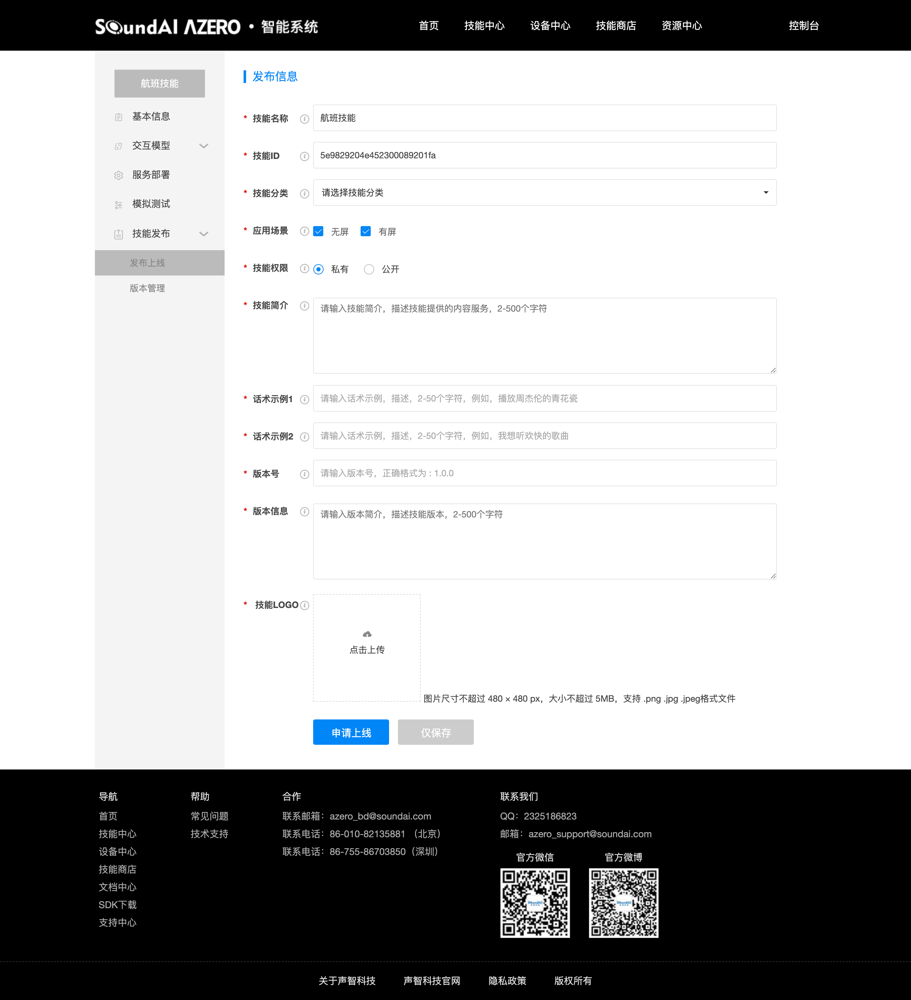

需要注意:

1,应用场景为无屏、有屏都勾选，则此技能能给有屏无屏设备都使用。如果只勾选了一个，那么只有相关设备能正常使用。如只勾选无屏，那么有屏设备不可以使用此技能。

2,技能权限若为私有，则您只可以为您自己的设备添加此技能。若为公开，您的技能会在技能商城中被显示，所有Azero平台上的开发者都可以使用您的技能。

以上则为一个完整的技能开发流程。


#### 真实设备如何解析技能的响应

真实设备解析技能的响应，实际上是解析技能返回的模板信息。

具体解析方式请参考具体设备端SDK中的README：

Azero Android SDK:  https://github.com/sai-azero/Azero_SDK_for_Android

Azero Linux SDK：https://github.com/sai-azero/Azero_SDK_for_Linux


#### 示例:段子技能_NodeJs

示例链接:https://github.com/sai-azero/skill-sample-nodejs-hello-world


#### 问答型技能

问答型技能用于用户的问题与答案，是多个问题对一个答案的简单关系场景下。

详情请参考:

问答型技能介绍：https://azero.soundai.com/docs/document

技能接入介绍 -> 自定义技能 -> 问答型技能


#### 问答型技能疫情一问一答示例

如用户可能使用此技能，查询:如何正确佩戴口罩?

技能需要回复:"亲爱的主人，佩戴口罩的基本原则是科学合理佩戴，规范使用，有效防护。具体如下喔：
1，在非疫区空旷且通风场所不需要佩戴口罩，进入人员密集或密闭公共场所需要佩戴口罩。
2，在疫情高发地区空旷且通风场所建议佩戴一次性使用医用口罩；进入人员密集或密闭公共场所佩戴医用外科口罩或果粒物防护口罩。
3，有疑似症状到医院就诊时，需佩戴不含呼气阀的颗粒物防护口罩或医用防护口罩。
4，有呼吸道基础疾病患者需在医生指导下使用防护口罩。年龄极小的婴幼儿
不能戴口罩，易引起窒息。
5，棉纱口罩、海绵口罩和活性炭口罩对预防病毒感染无保护作用。"。

则您可以在网站上这么配置:

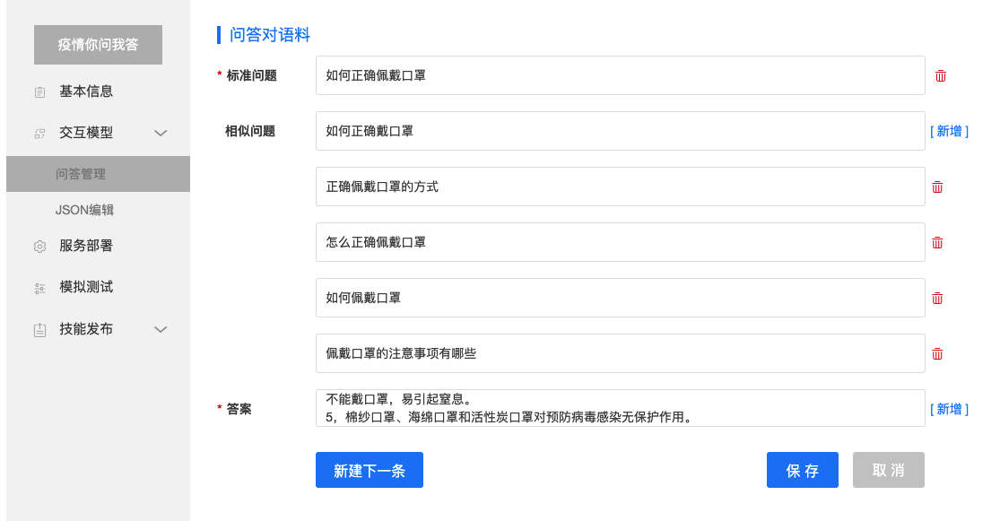

配置完成之后，单击保存，即可在模拟测试中，模拟用户真实的使用场景。测试正常的情况应如下:

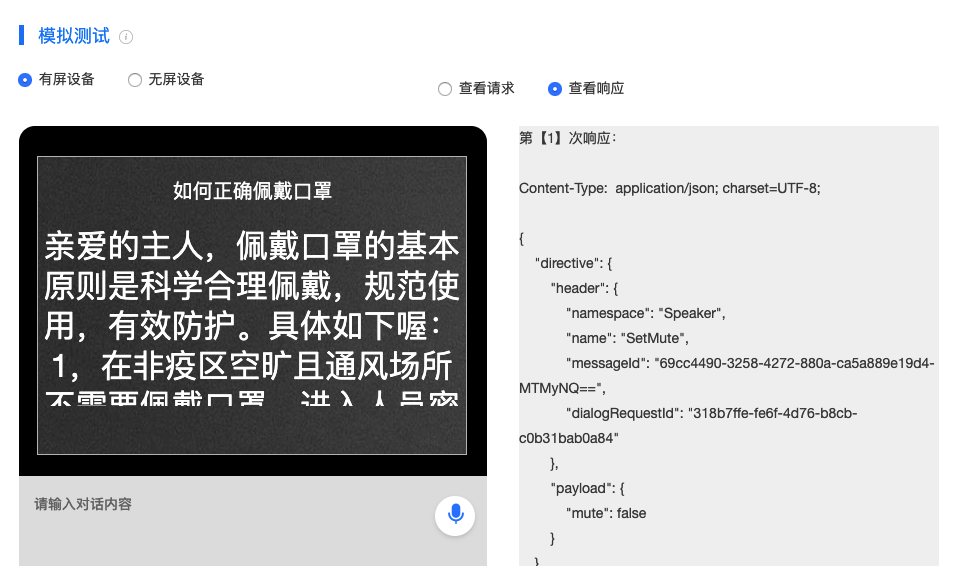

测试通过后，即可将技能发布上线。发布上线的技能，需要Azero运营人员在后台进行审核，审核日期一般为1-2个工作日。当审核过后，您的问答型技能，即可为设备正常添加使用。

附件处有此技能的交互模型，可以直接复制到您新建的问答型技能的交互模型 -> Json编辑处。进行模拟测试使用。


## 信源类技能介绍

详情请参考:

信源类技能介绍：https://azero.soundai.com/docs/document

技能接入介绍 -> 内容信源技能


#### 信源类技能示例

信源类技能，主要是更新数据源，需要将您的信源转化成平台能识别的Schema(交互模型)。这样Azero平台能自动为您的信源内容建立索引，对于设备端，直接使用播放XXX(指代您信源内部资源，如许嵩的歌)即可使用您的信源内容。

如何将信源转化成Schema?

您可以根据 https://azero.soundai.com/docs/document 开发文档 -> 技能接入协议 -> 内容信源技能接入协议。选择对应的信源类型Schema查看规则。


## 智能家居技能介绍

### 创建智能家居技能

详情参考：打开官网文档中心https://azero.soundai.com/docs/document

技能接入介绍 -> 智能家居技能


### 完整使用智能家居技能

整体流程图如下：

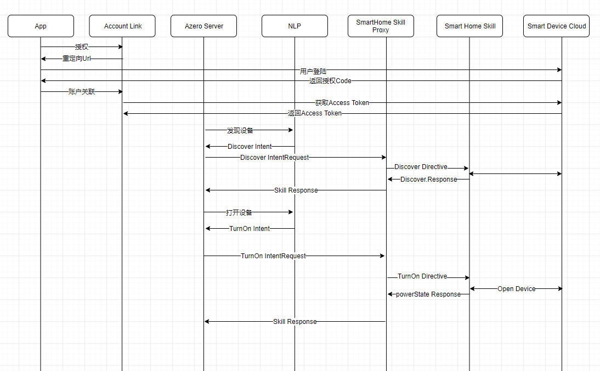

下文为详细过程。


### 准备工作

#### 真机准备

1. 完成创建智能家居技能(请参考第一步)，发布上线。
2. 网站创建一个设备，为该设备绑定该智能家居技能，发布上线。
3. 一台集成Azero Sdk的设备，此处以声智科技的mindot为例子。 
4. 将第二步中，申请的设备的product id 与client id刷入mindot。使得网站创建的设备与真实设备绑定。

当我们创建智能家居技能的时候，会要求填写以下信息，如截图：

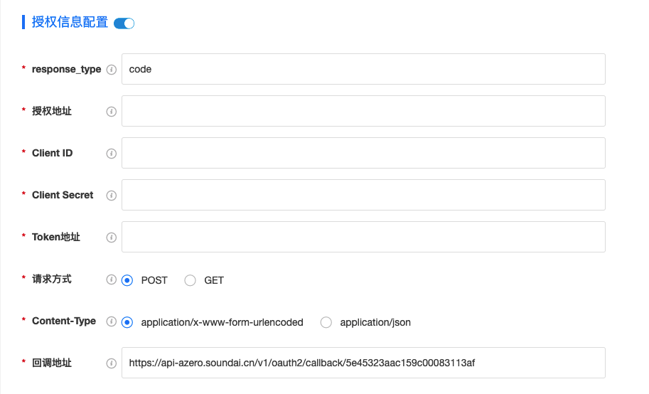

WebService:Azero Service(下文简称Azero)将会将所有与智能家居相关的请求都会按照智能家居协议发往该地址，用户对于该请求处理完之后，需按照相关协议进行返回。

授权地址:为技能的授权地址，联合配置的ClientID、Client Secret，这样可以把Azero当做一个客户端，访问授权地址，可以对Azero进行访问授权。

Token地址:由于有时Token具有时效性。因此，当Token过期时，Azero会去该地址获取新的Token。

智能家居技能创建成功，为某个设备client id绑定该技能，并将client id与真实设备绑定(此处与mindot绑定)，真机的准备工作已经完成。


#### 将Azero系统账号与设备进行绑定

首先需要注册并且登录Azero系统账号，步骤为:

**请求短信验证码** -> **调用注册接口** ->  **调用登录接口**。接口详情如下:


**Host地址:** https://api-azero.soundai.cn/

**发送短信验证码**

**简要描述：**

- 发送短信验证码接口

**请求URL：**

- `/v1/surrogate/users/verification`

**请求方式：**

- POST

**参数：**

| 参数名      | 必选 | 类型   | 说明                                  |
| :---------- | :--- | :----- | ------------------------------------- |
| phoneNumber | 是   | string | 手机号                                |
| countryCode | 是   | string | 区域代码                              |
| type        | 是   | string | 类型 REGISTER:注册 RESET_PWD:重置密码 |
| sender      | 是   | string | 短信发送方： 0-声智科技， 1-小声科技  |

**请求示例**

```
{
    "countryCode":"+86",
    "phoneNumber":"xxxx",
    "type":"REGISTER",
    "sender":0
}
```

**返回示例**

```
{
    "code": 200,
    "message": "success",
    "data": {
        "expiresIn": 600,
        "registered": true,
        "verificationId": "12345"
    }
}
```

**返回参数说明**

| 参数名         | 类型   | 说明                                                         |
| :------------- | :----- | ------------------------------------------------------------ |
| expiresIn      | int    | 手机号验证码的超时时间，取值单位为秒，超时以后需重新发送验证请求 |
| registered     | boolen | 该手机号是否已注册过账号                                     |
| verificationId | string | 手机号验证id，需要跟短信验证码一起提交                       |

先用手机号码申请验证码，验证码用于调用注册接口。

**用户注册**

**简要描述：**

- 用户注册接口

**请求URL：**

- `/v1/surrogate/users`

**请求方式：**

- POST

**参数：**

| 参数名           | 必选 | 类型   | 说明                                                         |
| :--------------- | :--- | :----- | ------------------------------------------------------------ |
| phone            | 是   | string | 手机号（不带+86）                                            |
| verificationId   | 是   | string | 发送短信验证码时接收到的手机号验证id                         |
| verificationCode | 是   | string | 用户收到的短信验证码                                         |
| password         | 是   | string | 设置的密码。注意不要传明文密码，请使用SHA256以上的Hash算法，加入跟hash值等长的固定盐值。生成的Hash值可采用Hex编码。该字段长度不超过128字节。 |

**请求示例**

```
{
    "phone": "13212312345",
    "verificationId": "4321",
    "verificationCode": "123321",
    "password":"xxxxxx"
}
```

**返回示例**

```
{
    "code": 200,
    "message": "success",
    "data": {
        "userId":"xxxxxx",
        "token":"xxxx"
    }
}
```

**返回参数说明**

| 参数名 | 类型   | 说明          |
| :----- | :----- | ------------- |
| userId | string | 用户id        |
| token  | string | 用户认证token |


**用户登录**

**简要描述：**

- 用户登录接口

**请求URL：**

- `/v1/surrogate/users/login`

**请求方式：**

- GET

**参数：**

| 参数名      | 必选 | 类型   | 说明              |
| :---------- | :--- | :----- | ----------------- |
| countryCode | 否   | string | 区域代码(默认+86) |
| phone       | 是   | string | 手机号            |
| password    | 是   | string | 密码              |

**请求示例**

```
/v1/surrogate/users/login?phone=xxxx&password=xxxx&countryCode=+86
```

**返回示例**

```
{
    "code": 200,
    "message": "success",
    "data": {
        "userId":"xxxxxx",
        "token":"xxxx"
    }
}
```

**返回参数说明**

| 参数名 | 类型   | 说明          |
| :----- | :----- | ------------- |
| userId | string | 用户id        |
| token  | string | 用户认证token |

获取到userid、与token，用于后续接口调用。


**然后调用用户绑定设备接口 ，将设备与Azero系统账号进行绑定:**

**用户绑定设备**

**简要描述：**

- 绑定设备接口

**请求URL：**

- `/v1/surrogate/users/device/bind`

**请求方式：**

- POST

**参数：**

| 参数名    | 必选 | 类型   | 说明                       |
| :-------- | :--- | :----- | -------------------------- |
| deviceSN  | 是   | string | 设备SN码                   |
| productId | 是   | string | 产品id                     |
| userId    | 是   | string | 用户id（支持第三方用户id） |
| token     | 否   | string | 设备绑定验证token          |
| deviceKey | 否   | string | 第三方定义的设备id         |
| name      | 否   | string | 设备名称                   |

**请求示例**

```
{
    "deviceSN": "xxxx",
    "productId": "xxxx",
    "userId": "xxxx",
    "token":"xxxx",
    "deviceKey": "xxxx",
    "name":"xxxx"
}
```

**返回示例**

```
{
    "code": 200,
    "message": "success",
    "data": {
        deviceId:"xxxx"
    }
}
```

**返回参数说明**

| 参数名   | 类型   | 说明   |
| :------- | :----- | ------ |
| deviceId | string | 设备id |

将必填信息填入请求中，且需要在请求头中，带入用户认证token（若在chrome中测试，可以在chrome安装ModHeader插件进行添加token配置）。只要返回200，则声智账号与真机绑定成功。


#### 将Azero系统账号与IOT云账号建⽴连接

此处需要用到调用登录接口后的userId与token。接口详情如下:

**用户授权跳转第三方登录页**

**简要描述：** 

- 用户授权跳转第三方登录页接口

**请求URL：** 

- `/v1/surrogate/accountlink/access`

**请求方式：**

- GET

**参数：** 

| skillId | 是   | string | 技能id |
| :------ | :--- | :----- | :----- |
| userId  | 是   | string | 用户id |
| 参数名  | 必选 | 类型   | 说明   |

 **请求示例**

```
/v1/surrogate/accountlink/access?skillId=xxxx&userId=xxxxx
```

 **返回示例**

```
{返回HttpCode 320，跳转到第三方平台登录页}
```

 **返回参数说明** 

无。

将必填信息填入请求中，且需要在请求头中，带入用户认证token（若在chrome中测试，可以在chrome安装ModHeader插件进行添加token配置）。请求如果成功，即会跳转到IOT云的登录页面。登录之后，Azero系统账号代表的userid将带给iot云，iot云可以做用户关联。azero系统会去智能家居技能中配置的token地址获取访问iot云的token，用于委托iot云处理智能家居命令使用。

至此Azero系统账号与IOT云账号建⽴连接成功。


### 测试智能家居技能

**发现设备**

以mindot为例，对音箱说："小易小易，发现设备"

Azero系统对于该指令进行理解后，会向创建的智能家居技能中的webservice地址发送如下报文:

**Discover**

**Header**

| 属性      | 取值                      |
| :-------- | :------------------------ |
| name      | Discover                  |
| namespace | Azero.SmartHome.Discovery |

**Payload**

| 属性  | 描述                                       | 是否必须 |
| :---- | :----------------------------------------- | :------- |
| type  | BearerToken                                | 是       |
| token | 第三方智能家居设备云端获取的access token。 | 是       |

**举例**

```
{
  "directive": {
    "header": {
      "namespace": "Azero.SmartHome.Discovery",
      "name": "Discover",
      "messageId": "<message id>",
      "payloadVersion": "3"
    },
    "payload": {
      "scope": {
        "type": "BearerToken",
        "token": "<an OAuth2 bearer token>"
      }
    }
  }
}
```


**Discover.Response**

webservice地址处理**Discover**消息时，如果查找到设备，需按照**Discover.Response**格式返回设备的相关信息，如果没有找到设备时，则按格式返回空数组。

**Header信息**

| 属性      | 取值                      |
| :-------- | :------------------------ |
| name      | Discover.Response         |
| namespace | Azero.SmartHome.Discovery |

**Payload**

**设备信息**

| 属性                 | 描述说明                                     | 是否必须 |
| :------------------- | :------------------------------------------- | :------- |
| endpoints            | 以对象数组返回客户关联设备云帐户的设备、场景 | 是       |
| endpointId           | 智能家居设备唯一标识                         | 是       |
| manufacturerName     | 智能家居设备厂商名字                         | 是       |
| description          | 智能家居设备描述                             | 是       |
| friendlyName         | 智能家居设备别名                             | 是       |
| additionalAttributes | 以对象数组返回智能家居设备属性               | 否       |
| displayCategories    | 支持的设备类型                               | 是       |
| capabilities         | 以对象数组返回支持的设备接口                 | 是       |

**举例**

```
{
  "event": {
    "header": {
      "namespace": "Azero.SmartHome.Discovery",
      "name": "Discover.Response",
      "payloadVersion": "3",
      "messageId": "<message id>"
    },
    "payload": {
      "endpoints": [
        {
          "endpointId": "appliance-001",
          "manufacturerName": "Sample Manufacturer",
          "description": "Smart Light by Sample Manufacturer",
          "friendlyName": "Living Room Light",
          "additionalAttributes":  {
            "manufacturer" : "Sample Manufacturer",
            "model" : "Sample Model",
            "serialNumber": "<the serial number of the device>",
            "firmwareVersion" : "<the firmware version of the device>",
            "softwareVersion": "<the software version of the device>",
            "customIdentifier": "<your custom identifier for the device>"
          },
          "displayCategories": [
            "LIGHT"
          ],
          "capabilities": [
              {
                "type": "AzeroInterface",
                "interface": "Azero.SmartHome.BrightnessController",
                "version": "3",
                "properties": {
                  "supported": [
                    {
                      "name": "brightness"
                    }
                  ],
                  "proactivelyReported": true,
                  "retrievable": true
                }
            },
            {
              "type": "AzeroInterface",
              "interface": "Azero.SmartHome.ColorController",
              "version": "3",
              "properties": {
                "supported": [
                  {
                    "name": "color"
                  }
                ],
                "proactivelyReported": true,
                "retrievable": true
              }
            },
            {
              "type": "AzeroInterface",
              "interface": "Azero.SmartHome.ColorTemperatureController",
              "version": "3",
              "properties": {
                "supported": [
                  {
                    "name": "colorTemperatureInKelvin"
                  }
                ],
                "proactivelyReported": true,
                "retrievable": true
              }
            },
            {
              "type": "AzeroInterface",
              "interface": "Azero.SmartHome.EndpointHealth",
              "version": "3",
              "properties": {
                "supported": [
                  {
                    "name": "connectivity"
                  }
                ],
                "proactivelyReported": true,
                "retrievable": true
              }
            }
          ],
          "connections": [
            {
              "type": "TCP_IP",
              "macAddress": "00:11:22:AA:BB:33:44:55"
            },
            {
              "type": "ZIGBEE",
              "macAddress": "00:11:22:33:44:55"
            },
            {
              "type": "ZWAVE",
              "homeId": "<0x00000000>",
              "nodeId": "<0x00>"
            },
            {
              "type": "UNKNOWN",
              "value": "00:11:22:33:44:55"
            }
          ],
          "cookie": {
          }
        }
      ]
    }
  }
}
```


#### 控制设备

以打开灯为例，会用到如下报文。

**TurnOn**

**header**

| 属性      | 取值                            |
| :-------- | :------------------------------ |
| name      | TurnOn                          |
| namespace | Azero.SmartHome.PowerController |

**endpoint**

| 属性        | 描述说明                   | 是否必须 |
| :---------- | :------------------------- | :------- |
| scope.type  | BearerToken                | 是       |
| scope.token | 设备云端获取的access token | 是       |
| endpointId  | 设备标识符                 | 是       |

**举例**

当用户说“小易小易，打开电灯”，Azero系统理解到用户意图后，会向配置的智能家居技能发送TurnOn消息，消息会传到技能中配置的webservice，消息示例如下：

```
{
  "directive": {
    "header": {
      "namespace": "Azero.SmartHome.PowerController",
      "name": "TurnOn",
      "messageId": "<message id>",
      "correlationToken": "<an opaque correlation token>",
      "payloadVersion": "3"
    },
    "endpoint": {
      "scope": {
        "type": "BearerToken",
        "token": "<an OAuth2 bearer token>"
      },
      "endpointId": "<endpoint id>",
      "cookie": {}
    },
    "payload": {}
  }
}
```

**powerState**

webservice地址需要处理**TurnOn**的消息，控制设备，然后以**powerState**返回给azero系统。

**context**

| 属性      | 取值                            |
| :-------- | :------------------------------ |
| name      | powerState                      |
| namespace | Azero.SmartHome.PowerController |
| value     | ON、OFF                         |

**应用举例**

```
{
  "event": {
    "header": {
      "namespace": "Azero",
      "name": "Response",
      "messageId": "<message id>",
      "correlationToken": "<an opaque correlation token>",
      "payloadVersion": "3"
    },
    "endpoint": {
      "scope": {
        "type": "BearerToken",
        "token": "<an OAuth2 bearer token>"
      },
      "endpointId": "<endpoint id>"
    },
    "payload": {}
  },
  "context": {
    "properties": [
      {
        "namespace": "Azero.SmartHome.PowerController",
        "name": "powerState",
        "value": "ON",
        "timeOfSample": "2017-02-03T16:20:50.52Z",
        "uncertaintyInMilliseconds": 500
      }
    ]
  }
}
```

至此，控制流程就已经全部完成。


### 了解智能家居协议

想了解更多协议内容可以参考：打开官网文档中心https://azero.soundai.com/docs/document

开发文档 -> 技能接入协议 -> 智能家居技能接入协议

此级目录包含文档:发现设备、设备属性、控制消息、查询消息、状态上报。

## 附件

航班技能交互模型:

~~~
{
	"interactionModel":{
		"languageModel":{
			"intents":[
				{
					"title":"定机票",
					"name":"booktickets",
					"samples":[
						{
							"content":"我想订机票"
						},
						{
							"content":"我想订${city}到${city1}的机票"
						}
					],
					"slots":[
						{
							"name":"city",
							"type":"AZERO.City"
						},
						{
							"name":"city1",
							"type":"AZERO.City"
						}
					]
				}
			],
			"dictionaries":[
				{
					"title":"城市",
					"name":"AZERO.City"
				}
			]
		},
		"dialog":{
			"intents":[
				{
					"title":"定机票",
					"name":"booktickets",
					"confirmationRequired":true,
					"prompts":{
						"confirmation":[
							{
								"type":"PlainText",
								"value":"您确定订一张从${city}到${city1}的机票吗"
							}
						]
					},
					"slots":[
						{
							"name":"city",
							"type":"AZERO.City",
							"confirmationRequired":false,
							"elicitationRequired":true,
							"prompts":{
								"elicitation":[
									{
										"type":"PlainText",
										"value":"您想订从哪儿起飞的机票"
									}
								]
							}
						},
						{
							"name":"city1",
							"type":"AZERO.City",
							"confirmationRequired":false,
							"elicitationRequired":true,
							"prompts":{
								"elicitation":[
									{
										"type":"PlainText",
										"value":"您想订到哪的机票"
									}
								]
							}
						}
					]
				}
			],
			"delegationStrategy":"ALWAYS"
		}
	},
	"nluEngineModel":{
		"generalization":{
			"intents":[
				{
					"name":"booktickets",
					"level":"STOP_WORDS_EXTENSION"
				}
			]
		}
	}
}
~~~


航班技能代码:

~~~
const azero = require('azero-sdk');
const azero_sdk = azero.sdk;

/**
 * Dialog委托场景COMPLETED完成之后Skill完成当前意图 Handle
 * 若完成当前意图后希望转到新意图withShouldEndSession需设为false，且需返回Dialog的Directive
 * @type {{canHandle(*=): *, handle(*=): *}}
 */
const  CompletedDelegateHandler_booktickets = {
    canHandle(handlerInput) {
        return azero.getIntentConfirm(handlerInput,'booktickets')
               && azero.getDialogState(handlerInput)==='COMPLETED';
    },
    handle(handlerInput) {
        let currentIntent = handlerInput.requestEnvelope.request.intent;
        let city = azero.getSlot(handlerInput,"city");
        let city1 = azero.getSlot(handlerInput,"city1");
        let speakOutput = '欢迎使用技能,您可根据当前意图和槽位返回您想回复的话术';
        return handlerInput.responseBuilder
        	.speak(speakOutput)
        	.withShouldEndSession(true)
        	.getResponse();
    }
};

/**
 * 非自动委托Dialog的澄清话术，验证槽位，确定槽位和确定意图等部分由Skill控制
 * 部分由网站上配置手动委托给Azero DM去追问
 * @type {{canHandle(*=): *, handle(*=): *}}
 */
const  CombineDialogDelegateHandler_booktickets = {
    canHandle(handlerInput) {
        return azero.getIntentConfirm(handlerInput,'booktickets')
               && (azero.getDialogState(handlerInput)==='STARTED'
               || azero.getDialogState(handlerInput)==='IN_PROGRESS');
    },
    handle(handlerInput) {
        let currentIntent = handlerInput.requestEnvelope.request.intent;
        let city = azero.getSlot(handlerInput,"city");
        let city1 = azero.getSlot(handlerInput,"city1");
        let speakOutput = '您可根据判断意图或者所有槽位返回您想回复的话术和模版';
//        handlerInput.responseBuilder.addElicitSlotDirective("槽位名称",currentIntent);
//        handlerInput.responseBuilder.addConfirmSlotDirective("槽位名称",currentIntent);
//        handlerInput.responseBuilder.addDelegateDirective(currentIntent);
//        handlerInput.responseBuilder.addConfirmIntentDirective(currentIntent);
        return handlerInput.responseBuilder
        	.addDelegateDirective(currentIntent)
        	.speak(speakOutput)
        	.withShouldEndSession(false)
        	.getResponse();
    }
};

/**
 * 用户取消和退出或者错误退出时的Handle
 * @type {{canHandle(*): *, handle(*): *}}
 */
const SessionEndedHandler={
    canHandle(handlerInput) {
        const request = handlerInput.requestEnvelope.request;
        return request.type === 'SessionEndedRequest';
    },
    handle(handlerInput) {
        return handlerInput.responseBuilder
        	.speak('已退出当前意图')
            .withShouldEndSession(true)
            .getResponse();
    }
}

const IntentRequestHandler = {
    canHandle(handlerInput) {
        return azero.getIntentRequest(handlerInput);
    },
    handle(handlerInput) {
        let speakOutput = "欢迎使用技能"; 
        return handlerInput.responseBuilder
            .addRenderTemplateDirective({
                type: `BodyTemplate1`,
                title: speakOutput,
                textContent: {
                    "primaryText": {
                        "text": speakOutput,
                        "type": "string"
                    }
                }
            })
            .speak('欢迎使用技能')
            .withShouldEndSession(true)
            .getResponse();
    }
};

exports.handler = azero_sdk.SkillBuilders.custom()
    .addRequestHandlers(
        CompletedDelegateHandler_booktickets,
        CombineDialogDelegateHandler_booktickets,

        SessionEndedHandler,
        IntentRequestHandler
    ).lambda();


~~~


疫情一问一答交互模型:

~~~
{
	"faq":[
		{
			"answers":[
				"亲爱的主人，市面上一共有4种类型的口罩，防护效果从低到高排列分别是一次性医用口罩、医用外科口罩、KN95或N95及以上颗粒物防护口罩、医用防护口罩。医用防护口罩防护效果最好。小主人如果想了解不同类型口罩适合什么场景使用，可以对小易说:不同类型的口罩适合什么场景使用。"
			],
			"question":"市面上的口罩有什么区别",
			"similarQuestions":[
				"市面上有什么类型的口罩",
				"不同口罩的区别是什么",
				"市面上的口罩有什么不同",
				"N九五和普通一次性口罩的区别",
				"口罩有什么区别"
			]
		},
		{
			"answers":[
				"亲爱的主人，一次性医用口罩推荐在非人员密集的公共场所使用。医用外科口罩防护效果优于一次性医用口罩，推荐疑似病例、公共交通司乘人员、出租车司机、环卫工人。公共场所服务人员等在岗期间佩戴。KN95或N95及以上颗粒物防护口罩：防护效果优于医用外科口罩、一次性医用口罩，推荐现场调査、采样和检测人员使用，主人如果去往人员高度密集场所或密闭公共场所也可佩戴。医用防护口罩则推荐发热门诊、隔离病房医护人员及确诊患者转移时佩戴。"
			],
			"question":"不同类型的口罩适合什么场景使用",
			"similarQuestions":[
				"什么场景需要带什么类型口罩",
				"什么场景需要带什么口罩"
			]
		},
		{
			"answers":[
				"亲爱的主人，根据国家卫生健康委疾控局建议，建议儿童选用符合国家标准GB2626-2006 KN95, 并标注儿童或青少年颗粒物防护口罩的产品。如果小主人还想了解儿童佩戴口罩注意事项，可以对小易说：儿童佩戴口罩注意事项。"
			],
			"question":"儿童适合什么类型的口罩",
			"similarQuestions":[
				"儿童的口罩有什么",
				"儿童适合什么样的口罩",
				"儿童口罩推荐"
			]
		},
		{
			"answers":[
				"亲爱的主人，在标准上，N95口罩是美国NIOSH认证，非油性颗粒物过滤效率需大于等于百分之95。KN95口罩是符合中国GB 2626 强制性标准，非油性颗粒物过滤效率需大于等于百分之95。所以在整个防护效果上来说，N95和KN95的效果是一样的，这种标准是没有直接性的区别的喔。"
			],
			"question":"KN95与N95口罩有什么区别",
			"similarQuestions":[
				"KN九五与N九五口罩有什么不同",
				"KN九五与N九五口罩有什么区别",
				"KN九五和N九五的区别在哪里",
				"KN95与N95口罩有什么不同"
			]
		},
		{
			"answers":[
				"亲爱的主人，小易也没有买到口罩，如果主人买到了，可以告诉小易去哪儿买嘛？小易也要好好落实防护措施！"
			],
			"question":"去哪儿买口罩",
			"similarQuestions":[
				"哪卖口罩",
				"现在哪里还能买口罩",
				"怎么买口罩",
				"在哪儿买口罩"
			]
		},
		{
			"answers":[
				"亲爱的主人，佩戴口罩的基本原则是科学合理佩戴，规范使用，有效防护。具体如下喔：\n1，在非疫区空旷且通风场所不需要佩戴口罩，进入人员密集或密闭公共场所需要佩戴口罩。\n2，在疫情高发地区空旷且通风场所建议佩戴一次性使用医用口罩；进入人员密集或密闭公共场所佩戴医用外科口罩或果粒物防护口罩。\n3，有疑似症状到医院就诊时，需佩戴不含呼气阀的颗粒物防护口罩或医用防护口罩。\n4，有呼吸道基础疾病患者需在医生指导下使用防护口罩。年龄极小的婴幼儿\n不能戴口罩，易引起窒息。\n5，棉纱口罩、海绵口罩和活性炭口罩对预防病毒感染无保护作用。"
			],
			"question":"如何正确佩戴口罩",
			"similarQuestions":[
				"如何正确戴口罩",
				"正确佩戴口罩的方式",
				"怎么正确佩戴口罩",
				"如何佩戴口罩",
				"佩戴口罩的注意事项有哪些"
			]
		}
	]
}
~~~

